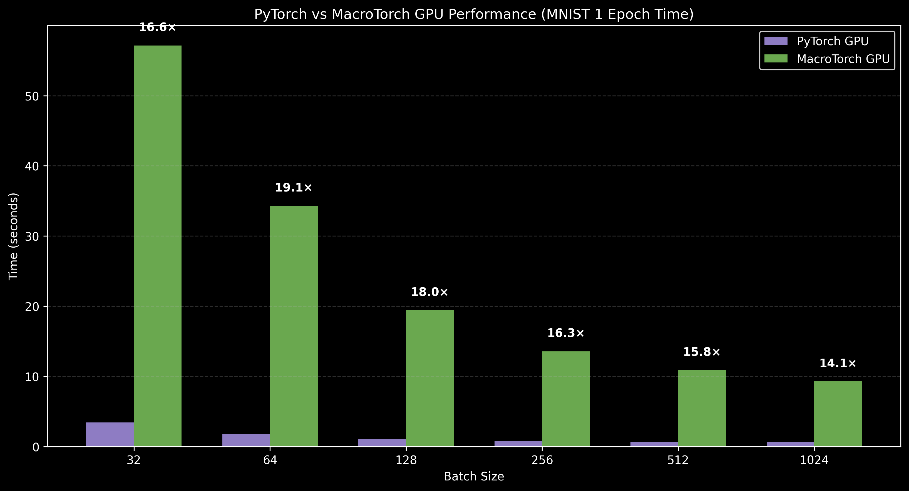

# MacroTorch


Custom CUDA kernels for 4D multi-channel convolution with PyTorch-style API. Built using NumPy for seamless data handling and Numba for optimized CUDA performance. Supports optimized forward/backward passes with shared memory tiling, FP16/FP32 support.

## Project Structure

```
macrotorch/
├── pyproject.toml       # pip install config
├── README.md
├── BENCHMARKS.md        # Detailed benchmarks
├── train_mnist.py       # Standalone MNIST training script
├── macrotorch/
│   ├── __init__.py      # Exports
│   ├── kernels.py       # CUDA kernel definitions
│   ├── ops.py           # Dispatch functions
│   └── layers.py        # Conv2d layer class
└── examples/
    ├── benchmark.py              # Benchmark script
    └── train_mnist_comparison.py # MNIST training & comparison
```

## 🚀 Quick Start

### Installation

```bash
git clone https://github.com/ggSohamgg/macrotorch.git
cd macrotorch
pip install -e .
```

### For Benchmarking (with PyTorch comparison)

To run the examples in `examples/`, you need `torch` and `scipy` installed.
You can install these dependencies using the `benchmark` extra:

```bash
pip install -e .[benchmark]
```

### Running Benchmarks

```bash
python examples/benchmark.py
```

### Running MNIST Training Comparison (MacroTorch vs PyTorch)

This script trains a CNN on MNIST using both frameworks and compares training time and accuracy.

```bash
python examples/train_mnist_comparison.py
```

### Training MNIST (Standalone)

Run a standalone training session on MNIST using MacroTorch with progress bars. You can edit `train_mnist.py` directly to modify the architecture, batch size, learning rate, or number of epochs.

```bash
python train_mnist.py
```

### Basic Usage

```python
import numpy as np
from macrotorch import conv2d_forward

# Input: (Batch, Channels, Height, Width)
img = np.random.randn(8, 3, 224, 224).astype(np.float32)
# Weight: (Cout, Cin, Kh, Kw)
weight = np.random.randn(16, 3, 3, 3).astype(np.float32)
bias = np.random.randn(16).astype(np.float32)

# Forward pass
output = conv2d_forward(img, weight, padding=1, bias=bias)
print(output.shape) # (8, 16, 224, 224)
```

### MNIST Train Performance
Performance metrics for a single training epoch on the MNIST dataset, evaluated across batch sizes ranging from 32 to 1024.



## 🛠️ Under the Hood: Why is it fast?

MacroTorch doesn't just use naive loops. It achieves high performance through standard industry techniques implemented from scratch in Numba CUDA:

- **Im2Col Transformation**: 4D Convolutions are lowered into 2D Matrix Multiplications (GEMM), allowing for high-throughput linear algebra operations instead of complex 4D indexing.
- **Tiled Matmul with Shared Memory**: Our custom GEMM kernels use 16x16 shared memory tiles to maximize data reuse and minimize slow Global Memory bandwidth bottlenecks.
- **Asynchronous Execution**: Leverages `torch.cuda.Event` and stream synchronization to ensure benchmarks measure raw kernel execution time, not host-side overhead.
- **Atomic Gradient Accumulation**: The `col2im` operation in the backward pass uses highly efficient hardware-level atomic additions to aggregate gradients correctly across the batch.
- **FP32 Accumulation**: Even when running FP16 benchmarks, weights are accumulated in FP32 precision to maintain numerical stability and match PyTorch accuracy.

## 📊 Performance Benchmarks (Tesla T4)

MacroTorch achieves competitive performance, with **custom kernels that beat PyTorch** in specific operations:

| Kernel | Configuration | vs PyTorch |
| :--- | :--- | :---: |
| **Weight Backward (2D Legacy)** | 8×128×128, 3×3, FP32 | **4.1x faster** |
| **Weight Backward (2D Legacy)** | 8×128×128, 3×3, FP16 | **3.5x faster** |
| **MaxPool2D Backward** | 8×64×128×128, pool=2 | **2.6x faster** |
| **Softmax Backward** | 8×10×1×1, FP32 | **2.7x faster** |
| **Cross-Entropy Backward** | 256×1000, FP32 | **2.2x faster** |
| **ReLU Backward** | 1024×1024, FP32 | **1.7x faster** |

### Additional Highlights
- **10-17x speedup** over CPU for forward/backward passes
- **31-66x speedup** over CPU for bias gradient computation
- **Better FP16 precision** than PyTorch in bias gradient (2.75e-04 vs 2.27e-01)

**[View Detailed Benchmarks](BENCHMARKS.md)**

## ⚠️ Limitations

- No Tensor Core usage
- No kernel fusion
- Higher kernel launch overhead than CUDA C++
- Not optimized for large-scale training workloads
- Intended for research and learning, not production deployment

## 🚧 Why PyTorch Is Faster Overall

Despite optimizations, MacroTorch is slower than PyTorch for full model training due to:

- cuDNN kernel fusion (Conv + Bias + Activation)
- Tensor Core acceleration for FP16/TF32
- CUTLASS-based GEMM implementations
- CUDA Graphs reducing kernel launch overhead
- Highly optimized memory layouts and vectorized loads

MacroTorch kernels are written using Numba CUDA, which prioritizes clarity and flexibility over access to low-level hardware features such as WMMA instructions.


## 📝 Acknowledgments

- **Core CUDA Kernels** (`macrotorch/kernels.py`): Handwritten by [@ggSohamgg](https://github.com/ggSohamgg) — the shared memory tiling, kernel optimizations, and all CUDA implementations are original work.
- **Benchmarks & Utilities** (`examples/benchmark.py`, `ops.py`, etc.): AI-assisted development with help from LLMs for boilerplate, documentation, and testing infrastructure.

*Credit where credit's due!* 🤝
